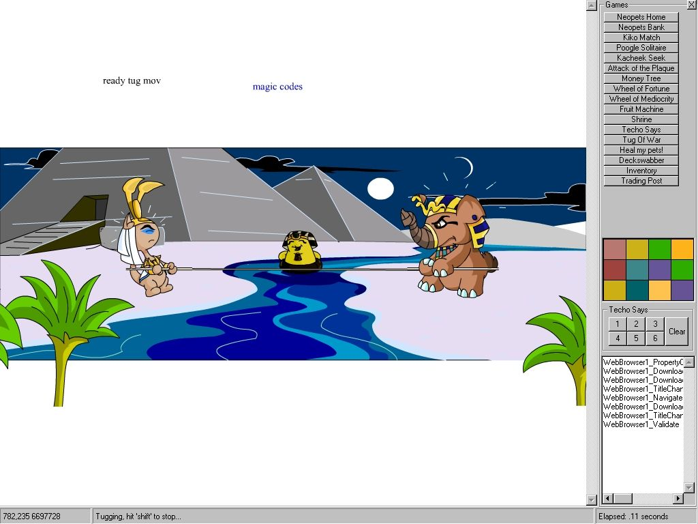



## Control Internet Explorer via SHDOCVW in VB

### Description

Control IE through VB! Use the WebBrowser control in VB, and automatically navigate to sites, click buttons, fill in text fields, and more.

As an example, I've included the 'NeoPets Helper' I made for my young daughter. NeoPets is a gaming web site that lets you have virtual 'pets'. You play various NeoPets games to earn NeoPoints, so you can feed your pets. However, my daughter's NeoPets were always starving because she couldn't play their games well. :-( So, I made this program for her.

Anyways! Don't look at it for the NeoPets tips, look at it for tips on how to control IE through VB! It shows you how to navigate to various sites, wait until they load, click buttons, do generic mouse clicks and drags, extract text from the web page, fill in text fields on the web page, do 'screen scraping', press keys, and more. Feel free to use this program however you wish - but DON'T give me any credit, I don't want to know what you use it for. :-D
 
### More Info
 

             |
---                |---
**Submitted On**   |2001-11-26 14:38:30
**By**             |[Kamilche](https://github.com/Planet-Source-Code/PSCIndex/blob/master/ByAuthor/kamilche.md)
**Level**          |Beginner
**User Rating**    |4.9 (88 globes from 18 users)
**Compatibility**  |VB 5\.0, VB 6\.0
**Category**       |[Internet/ HTML](https://github.com/Planet-Source-Code/PSCIndex/blob/master/ByCategory/internet-html__1-34.md)
**World**          |[Visual Basic](https://github.com/Planet-Source-Code/PSCIndex/blob/master/ByWorld/visual-basic.md)
**Archive File**   |[Control\_In3763011262001\.zip](https://github.com/Planet-Source-Code/kamilche-control-internet-explorer-via-shdocvw-in-vb__1-29239/archive/master.zip)

